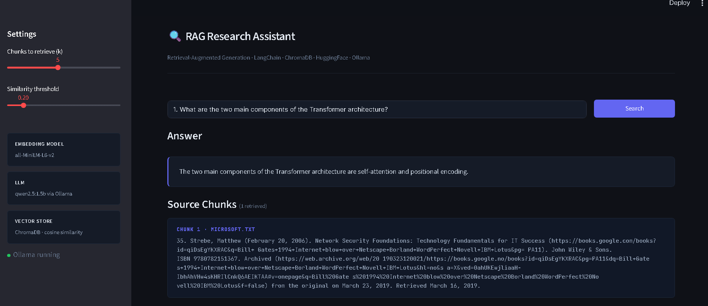
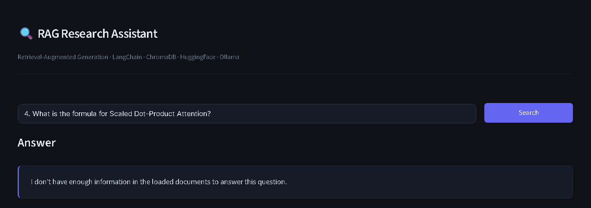

# Advanced RAG Pipeline

A comprehensive implementation of Retrieval-Augmented Generation (RAG) techniques — from basic ingestion to advanced retrieval strategies — built with LangChain, ChromaDB, and HuggingFace Transformers.

---

## Overview

This project explores and implements the full spectrum of RAG system design, covering document ingestion, multiple chunking strategies, retrieval methods, reranking, and multi-modal support. It is structured as a progressive series of modules, each isolating a specific RAG concept or technique.

---

## Tech Stack

- **LangChain** — pipeline orchestration and chain composition
- **ChromaDB** — persistent vector store for embeddings
- **HuggingFace Transformers** — embedding models and language models
- **PyPDF / Unstructured** — multi-format document ingestion (PDF, TXT, DOCX)
- **OpenCV + PIL** — image processing for multi-modal RAG
- **rank-bm25** — sparse retrieval for hybrid search
- **Cohere** — reranking API
- **Python 3.13**

---

## Screenshots




---


## Project Structure

```
RAG_Learning/
│
├── 1_ingestion_pipeline.py              # Document loading, chunking, embedding & storing into ChromaDB
├── 2_retrieval_pipeline.py              # Basic similarity search retrieval
├── 3_answer_generation.py               # End-to-end RAG: retrieve + generate answers
├── 4_history_aware_generation.py        # Conversational RAG with chat history memory
│
├── 5_recursive_character_text_splitter.py  # Recursive character-level chunking
├── 6_semantic_chunking.py               # Embedding-based semantic chunking
├── 7_agentic_chunking.py                # LLM-driven agentic chunking (proposition-level)
│
├── 8_multi_modal_rag.ipynb              # RAG over mixed data types (text + images)
│
├── 9_retrieval_methods.py               # Comparison of retrieval strategies
├── 10_multi_query_retrieval.py          # Query expansion via multiple LLM-generated queries
├── 11_reciprocal_rank_fusion.py         # RRF-based result fusion across multiple retrievers
├── 12_hybrid_search.ipynb               # Dense + sparse (BM25) hybrid retrieval
├── 13_reranker.ipynb                    # Cross-encoder reranking of retrieved chunks
│
├── docs/                                # Sample documents (PDF + TXT)
│   ├── attention-is-all-you-need.pdf
│   ├── Google.txt
│   ├── Microsoft.txt
│   ├── Nvidia.txt
│   ├── SpaceX.txt
│   └── Tesla.txt
│
├── db/                                  # ChromaDB persistent vector store (auto-generated)
├── requirements.txt
└── synthetic_questions.txt              # Test queries for evaluation
```

---

## Techniques Implemented

### Chunking Strategies
| Strategy | Description |
|---|---|
| Recursive Character Splitting | Splits by characters with configurable chunk size and overlap |
| Semantic Chunking | Groups sentences by embedding similarity before splitting |
| Agentic Chunking | Uses an LLM to identify proposition boundaries for fine-grained chunks |

### Retrieval Methods
| Method | Description |
|---|---|
| Similarity Search | Standard dense vector cosine similarity retrieval |
| Multi-Query Retrieval | Generates multiple query variants via LLM to improve recall |
| Reciprocal Rank Fusion | Fuses ranked lists from multiple retrievers into a single result |
| Hybrid Search | Combines dense (embedding) and sparse (BM25) retrieval |
| Reranking | Cross-encoder reranking of top-k retrieved chunks for precision |

### Additional Capabilities
- **Conversational RAG** — history-aware retrieval that reformulates queries based on chat context
- **Multi-modal RAG** — ingestion and retrieval over documents containing both text and images

---

## Getting Started

### 1. Clone the repository
```bash
git clone https://github.com/Asifmd45/Advanced-RAG-Pipeline.git
cd Advanced-RAG-Pipeline
```

### 2. Create a virtual environment
```bash
python -m venv venv
venv\Scripts\activate  # Windows
```

### 3. Install dependencies
```bash
pip install -r requirements.txt
```

### 4. Set up environment variables
Create a `.env` file in the root directory:
```
OPENAI_API_KEY=your_openai_api_key
COHERE_API_KEY=your_cohere_api_key        # required for reranker module
```

### 5. Run any module
```bash
python 1_ingestion_pipeline.py
python 3_answer_generation.py
```

---

## Sample Documents

The `docs/` folder contains a mix of:
- **PDF**: *Attention Is All You Need* (Vaswani et al., 2017) — the original Transformer paper
- **TXT**: Company overviews for Google, Microsoft, Nvidia, SpaceX, and Tesla

This combination demonstrates the pipeline's ability to handle heterogeneous document types within a single vector store.

---

## Key Learnings

- Chunking strategy significantly impacts retrieval quality — agentic chunking outperforms naive splitting on technical documents
- Multi-query retrieval improves recall on ambiguous or broad questions
- Hybrid search (dense + BM25) handles both semantic and keyword-sensitive queries better than either alone
- Reranking adds a precision layer that reduces noise in top-k results